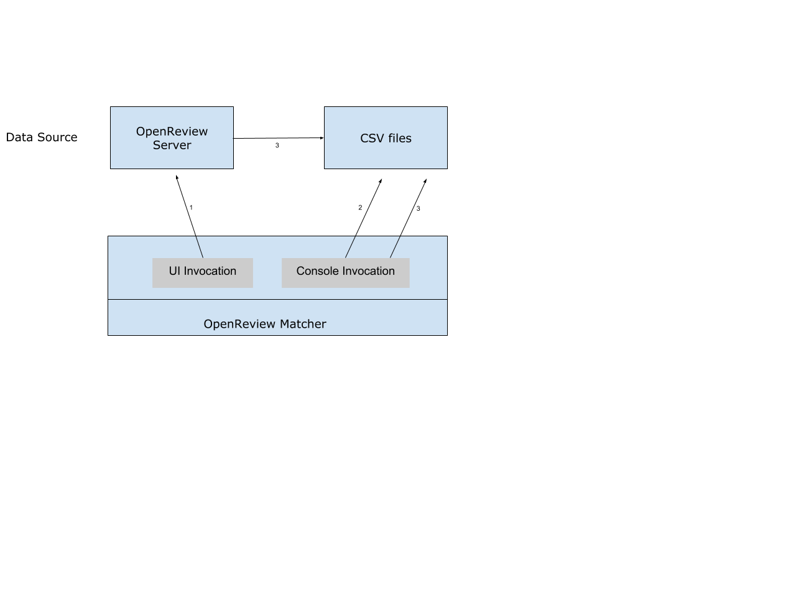

Using OpenReview Matcher
============================

About
-------

OpenReview Matcher is a tool for computing optimal paper-reviewer matches for peer review, subject to constraints and affinity scores.

The matcher has a web server integrated with the OpenReview server application.

This document explains how Program Chairs can use the OpenReview matcher tool for their venues.

Ways to use OpenReview matcher
--------------------------------

Currently, there are three ways to interact with the OpenReview matcher for solving a matching problem for a venue:

1. Program Chairs can access the OpenReview assignments page for their venue to initiate new match calculations by providing the required configuration which includes min and max papers to be assigned to each reviewer, Number of papers each reviewer must complete, Number of alternates required per paper, Match Group, Map of weights, and OpenReview invitations for scores, conflicts and custom loads. Once a match appears with the status Complete, Program Chairs can browse the calculated match using the OpenReview edge browser. This tool allows adding manual tweaks to the match.

2. The matcher can be run from the command line and CSV file inputs to provide score and constraints.
This requires a local installation of the github repo openreview-matcher. Steps for this can be found at https://github.com/openreview/openreview-matcher.

Local invocation example::

	>>>python -m matcher \
	--scores affinity_scores.csv \
	--constraints constraints.csv \
	--weights 1 \
	--min_papers 1 \
	--max_papers 10 \
	--num_reviewers 3 \
	--num_alternates 3 \
	--solver FairFlow

One or more score files can be input here with each row in a file containing comma-separated paperID, userID, and score (in that order).
e.g. "paper1,reviewer1,0.5"
Similarly, one or more constraint files can be provided with each file havings rows containing comma-separated paperId, userID, and constraint (in that order).
Note that constraint values must be -1 (conflict), 1 (forced assignment), or 0 (no effect).
e.g. "paper1,reviewer1,-1".

3. The first 2 ways can solve a paper-reviewer matching problem using either MinCost or FairFlow algorithms. If the Program Chairs wish to run their own solver algorithm they can do so locally.
To get the data required for this, one would need to know the OpenReview invitations being used for the different kinds of scores and constraints.

OpenReview uses Edge objects to store these scores and conflicts. To get the OpenReview edges for a particular type of scores::

	>>>client = openreview.Client(baseurl='http://localhost:3000', username='', passwor='')
	>>>paper_affinity_score_edges = openreview.tools.iterget_edges(client, invitation='ICLR.cc/2020/Conference/-/Affinity_Score')
	>>>paper_conflict_score_edges = openreview.tools.iterget_edges(client, invitation='ICLR.cc/2020/Conference/-/Conflict')

These edges then can be converted into matrices to feed into a different matcher algorithm.

Generally, such algorithms take the following inputs:
-