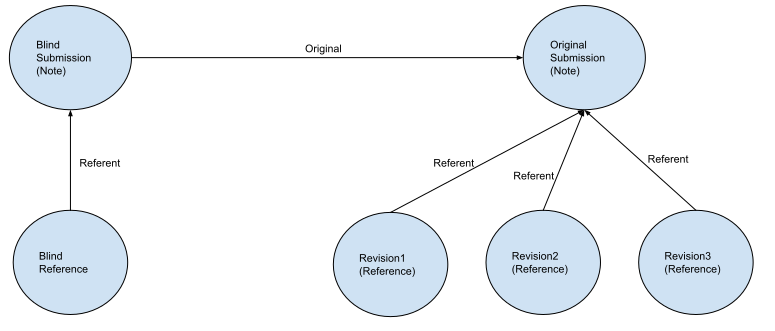

Mental Models
==============

In this section we attempt to illustrate some of the mental models behind OpenReview.

Blind Submissions (Blind Notes).
--------------------------------
OpenReview blinds certain author information for certain conferences (using the Blind Submission). This information may later be revealed depending on the policies of the conference.

All the submissions in a Conference are represented by Notes in OpenReview. Therefore, a Note will contain all the Submission information. In order to blind a Note, another Note pointing to the original Note is created as can be seen in the diagram below. This new Note is an exact copy of the original Note except that it hides the authors' identities.

The References pointing to the Notes through the referent in this example are revisions done to the submission. Revision1, Revision2 and Revision3 also contain the authors' identities. In order to hide this information, a blind Reference is also created which masks the sensitive information of the References. All of this is done so that more users are allowed to see paper submissions without knowing the author names.

