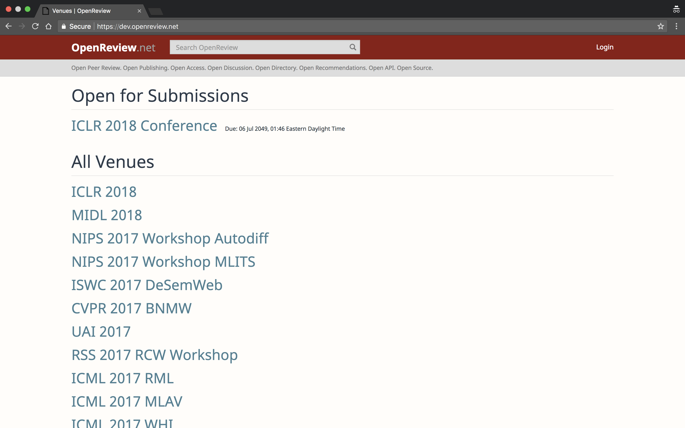
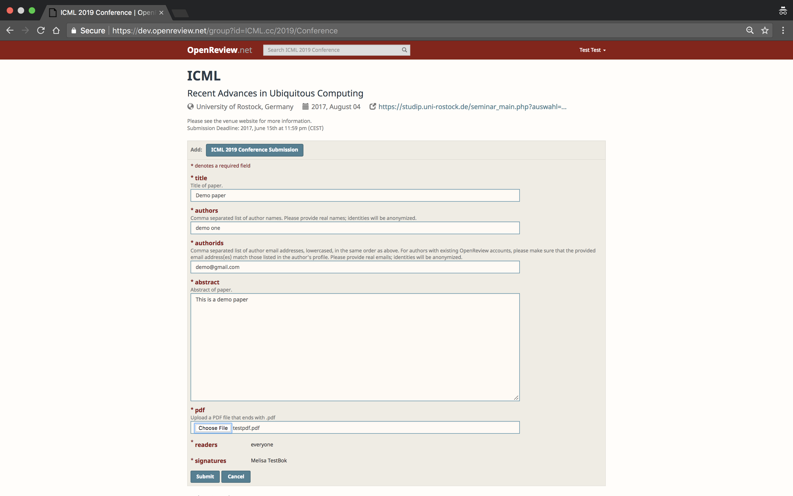
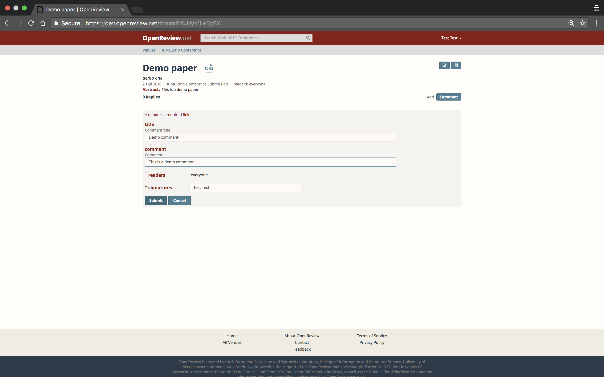

Creating a conference
========================

Demo Workshop
---------------

Here we explain some of the steps for creation of a new conference on OpenReview system.

Some of the tasks described below (such as creation of a conference sub-group, creation of a submission, etc) can only be done using an administrator profile.

If you are registered as an administrator with OpenReview, you should already have admin privileges on a group representing your conference (e.g. ICML.cc/2019/Conference).

Following are the steps and brief explanations.

Login
---------

Login can be done through the API ::

    >>> import openreview
    >>> client = openreview.Client(baseurl='https://openreview.net',username=<your username>,password=<your password>)

Creating a conference
------------------------

You need admin privileges for creating subgroups within a group representing your conference (e.g. ICML.cc). When you create new groups, they must be subgroups of this conference (e.g. ICML.cc/2019)"

To create the conference you represent, Openreview team will create a group ::

    >>> client.post_group(openreview.Group(id = 'ICML.cc', 
                                         readers = ['everyone'], 
                                         writers = ['OpenReview.net'], 
                                         signatories = ['ICML.cc'], 
                                         signatures = ['OpenReview.net']))

::

	{'cdate': 1532031329209,
	'ddate': None,
	'id': u'ICML.cc',
	'members': [],
	'nonreaders': [],
	'readers': [u'everyone'],
	'signatories': [u'ICML.cc'],
	'signatures': [u'OpenReview.net'],
	'web': None,
	'writers': [u'OpenReview.net']}

Once you (the conference admin) receive information from the Openreview team that your conference root has been setup, you can begin to create subgroups under the root.
For instance, to create an ICML.cc conference for 2019 following steps should be done by the conference admin::

	>>> client.post_group(openreview.Group(id = 'ICML.cc/2019', 
                                         readers = ['everyone'], 
                                         writers = ['OpenReview.net'], 
                                         signatories = ['ICML.cc/2019'], 
                                         signatures = ['OpenReview.net']))

::

	{'cdate': 1532031902863,
	'ddate': None,
	'id': u'ICML.cc/2019',
	'members': [],
	'nonreaders': [],
	'readers': [u'everyone'],
	'signatories': [u'ICML.cc/2019'],
	'signatures': [u'ICML.cc'],
	'web': None,
	'writers': [u'ICML.cc']}

Next step would be to create another subgroup 'ICML.cc/2019/Conference'::

	>>> client.post_group(openreview.Group(id = 'ICML.cc/2019/Conference', 
                                         readers = ['everyone'], 
                                         writers = ['ICML.cc/2019'], 
                                         signatories = ['ICML.cc/2019/Conference'], 
                                         signatures = ['ICML.cc/2019'],
                                         members = [<Tilde id of members>],
                                         web = <Absolute path to JS file>))

::

	{'cdate': 1531339441440,
	'ddate': None,
	'id': u'ICML.cc/2019/Conference',
	'members': [],
	'nonreaders': [],
	'readers': [u'everyone'],
	'signatories': [u'ICML.cc/2019/Conference'],
	'signatures': [u'ICML.cc/2019'],
	'web': u'\n// ------------------------------------\n// Basic venue homepage template\n//\n// This webfield displays the conference header (#header), the submit button (#invitation),\n// and a list of all submitted papers (#notes).\n// ------------------------------------\n\n// Constants\nvar CONFERENCE = "ICML.cc/2019/Conference";\nvar INVITATION = CONFERENCE + \'/-/Submission\';\nvar SUBJECT_AREAS = [\n  // Add conference specific subject areas here\n];\nvar BUFFER = 1000 * 60 * 30;  // 30 minutes\nvar PAGE_SIZE = 50;\n\nvar paperDisplayOptions = {\n  pdfLink: true,\n  replyCount: true,\n  showContents: true\n};\n\n// Main is the entry point to the webfield code and runs everything\nfunction main() {\n  Webfield.ui.setup(\'#group-container\', CONFERENCE);  // required\n\n  renderConferenceHeader();\n\n  load().then(render).then(function() {\n    Webfield.setupAutoLoading(INVITATION, PAGE_SIZE, paperDisplayOptions);\n  });\n}\n\n// RenderConferenceHeader renders the static info at the top of the page. Since that content\n// never changes, put it in its own function\nfunction renderConferenceHeader() {\n  Webfield.ui.venueHeader({\n    title: "ICML ",\n    subtitle: "Recent Advances in Ubiquitous Computing",\n    location: "University of Rostock, Germany",\n    date: "2017, August 04",\n    website: "https://studip.uni-rostock.de/seminar_main.php?auswahl=c9b2fd0a6f525ce968d41d737de3ccb5",\n    instructions: null,  // Add any custom instructions here. Accepts HTML\n    deadline: "Submission Deadline: 2017, June 15th at 11:59 pm (CEST) "\n  });\n\n  Webfield.ui.spinner(\'#notes\');\n}\n\n// Load makes all the API calls needed to get the data to render the page\n// It returns a jQuery deferred object: https://api.jquery.com/category/deferred-object/\nfunction load() {\n  var invitationP = Webfield.api.getSubmissionInvitation(INVITATION, {deadlineBuffer: BUFFER});\n  var notesP = Webfield.api.getSubmissions(INVITATION, {pageSize: PAGE_SIZE});\n\n  return $.when(invitationP, notesP);\n}\n\n// Render is called when all the data is finished being loaded from the server\n// It should also be called when the page needs to be refreshed, for example after a user\n// submits a new paper.\nfunction render(invitation, notes) {\n  // Display submission button and form\n  $(\'#invitation\').empty();\n  Webfield.ui.submissionButton(invitation, user, {\n    onNoteCreated: function() {\n      // Callback funtion to be run when a paper has successfully been submitted (required)\n      load().then(render).then(function() {\n        Webfield.setupAutoLoading(INVITATION, PAGE_SIZE, paperDisplayOptions);\n      });\n    }\n  });\n\n  // Display the list of all submitted papers\n  $(\'#notes\').empty();\n  Webfield.ui.submissionList(notes, {\n    heading: \'Submitted Papers\',\n    displayOptions: paperDisplayOptions,\n    search: {\n      enabled: true,\n      subjectAreas: SUBJECT_AREAS,\n      onResults: function(searchResults) {\n        Webfield.ui.searchResults(searchResults, paperDisplayOptions);\n        Webfield.disableAutoLoading();\n      },\n      onReset: function() {\n        Webfield.ui.searchResults(notes, paperDisplayOptions);\n        Webfield.setupAutoLoading(INVITATION, PAGE_SIZE, paperDisplayOptions);\n      }\n    }\n  });\n}\n\n// Go!\nmain();\n\n',
	'writers': [u'ICML.cc/2019']}

Please note that this conference group does not show up under the header "Open for Submissions" on Openreview homepage unless an invitation for submission with a future due date is created (as shown in the screenshot below).

Although, the conference 'ICML.cc/2019/Conference' that we just created is not accessible from "Open for Submissions", it can still be found on the Openreview homepage under the header "All Venues".

Note that the conference's URL is essentially the openreview url with the name of the conference group, i.e. "https://openreview.net/group?id=ICML.cc/2019/Conference".

.. figure:: ../_static/screenshots/conf_homepage_past_duedate.png
    :align: center

Note that the web field for the conference is either JS code or the absolute path of a JS file containing the code. 

Sample JS file
-----------------
::

	// ------------------------------------
	// Basic venue homepage template
	//
	// This webfield displays the conference header (#header), the submit button (#invitation),
	// and a list of all submitted papers (#notes).
	// ------------------------------------

	// Constants
	var CONFERENCE = "ICML.cc/2019/Conference";
	var INVITATION = CONFERENCE + '/-/Submission';
	var SUBJECT_AREAS = [
	  // Add conference specific subject areas here
	];
	var BUFFER = 1000 * 60 * 30;  // 30 minutes
	var PAGE_SIZE = 50;

	var paperDisplayOptions = {
	  pdfLink: true,
	  replyCount: true,
	  showContents: true
	};

	// Main is the entry point to the webfield code and runs everything
	function main() {
	  Webfield.ui.setup('#group-container', CONFERENCE);  // required

	  renderConferenceHeader();

	  load().then(render).then(function() {
	    Webfield.setupAutoLoading(INVITATION, PAGE_SIZE, paperDisplayOptions);
	  });
	}

	// RenderConferenceHeader renders the static info at the top of the page. Since that content
	// never changes, put it in its own function
	function renderConferenceHeader() {
	  Webfield.ui.venueHeader({
	    title: "ICML ",
	    subtitle: "Recent Advances in Ubiquitous Computing",
	    location: "University of Rostock, Germany",
	    date: "2017, August 04",
	    website: "https://studip.uni-rostock.de/seminar_main.php?auswahl=c9b2fd0a6f525ce968d41d737de3ccb5",
	    instructions: null,  // Add any custom instructions here. Accepts HTML
	    deadline: "Submission Deadline: 2017, June 15th at 11:59 pm (CEST) "
	  });

	  Webfield.ui.spinner('#notes');
	}

	// Load makes all the API calls needed to get the data to render the page
	// It returns a jQuery deferred object: https://api.jquery.com/category/deferred-object/
	function load() {
	  var invitationP = Webfield.api.getSubmissionInvitation(INVITATION, {deadlineBuffer: BUFFER});
	  var notesP = Webfield.api.getSubmissions(INVITATION, {pageSize: PAGE_SIZE});

	  return $.when(invitationP, notesP);
	}

	// Render is called when all the data is finished being loaded from the server
	// It should also be called when the page needs to be refreshed, for example after a user
	// submits a new paper.
	function render(invitation, notes) {
	  // Display submission button and form
	  $('#invitation').empty();
	  Webfield.ui.submissionButton(invitation, user, {
	    onNoteCreated: function() {
	      // Callback funtion to be run when a paper has successfully been submitted (required)
	      load().then(render).then(function() {
	        Webfield.setupAutoLoading(INVITATION, PAGE_SIZE, paperDisplayOptions);
	      });
	    }
	  });

	  // Display the list of all submitted papers
	  $('#notes').empty();
	  Webfield.ui.submissionList(notes, {
	    heading: 'Submitted Papers',
	    displayOptions: paperDisplayOptions,
	    search: {
	      enabled: true,
	      subjectAreas: SUBJECT_AREAS,
	      onResults: function(searchResults) {
	        Webfield.ui.searchResults(searchResults, paperDisplayOptions);
	        Webfield.disableAutoLoading();
	      },
	      onReset: function() {
	        Webfield.ui.searchResults(notes, paperDisplayOptions);
	        Webfield.setupAutoLoading(INVITATION, PAGE_SIZE, paperDisplayOptions);
	      }
	    }
	  });
	}

	// Go!
	main();

Creating Submission Invitations
----------------------------------

If you have administrator privileges in OpenReview, you will be able to create Invitations for Submissions for your conference using this API ::

    >>> client.post_invitation(openreview.Invitation(id = 'ICML.cc/2019/Conference/-/Submission',
                                            readers = ['everyone'],
                                            writers = ['ICML.cc/2019/Conference'],
                                            signatures = ['ICML.cc/2019/Conference'],
                                            invitees = ['everyone'],
                                            duedate = 1562875092000,
                                            reply = {
                                                    'forum': None,
                                                    'replyto': None,
                                                    'readers': {
                                                        'description': 'The users who will be allowed to read the above content.',
                                                        'values': ['everyone']
                                                    },
                                                    'signatures': {
                                                        'description': 'Your authorized identity to be associated with the above content.',
                                                        'values-regex': '~.*'
                                                    },
                                                    'writers': {
                                                        'values-regex': '~.*'
                                                    },
                                                    'content':{
                                                        'title': {
                                                            'description': 'Title of paper.',
                                                            'order': 1,
                                                            'value-regex': '.{1,250}',
                                                            'required':True
                                                        },
                                                        'authors': {
                                                            'description': 'Comma separated list of author names. Please provide real names; identities will be anonymized.',
                                                            'order': 2,
                                                            'values-regex': "[^;,\\n]+(,[^,\\n]+)*",
                                                            'required':True
                                                        },
                                                        'authorids': {
                                                            'description': 'Comma separated list of author email addresses, lowercased, in the same order as above. For authors with existing OpenReview accounts, please make sure that the provided email address(es) match those listed in the author\'s profile. Please provide real emails; identities will be anonymized.',
                                                            'order': 3,
                                                            'values-regex': "([a-z0-9_\-\.]{2,}@[a-z0-9_\-\.]{2,}\.[a-z]{2,},){0,}([a-z0-9_\-\.]{2,}@[a-z0-9_\-\.]{2,}\.[a-z]{2,})",
                                                            'required':True
                                                        },
                                                        'abstract': {
                                                            'description': 'Abstract of paper.',
                                                            'order': 4,
                                                            'value-regex': '[\\S\\s]{1,5000}',
                                                            'required':True
                                                        },
                                                        'pdf': {
                                                            'description': 'Upload a PDF file that ends with .pdf',
                                                            'order': 5,
                                                            'value-regex': 'upload',
                                                            'required':True
                                                        }
                                                    }
                                            }))

::

	{'cdate': 1531339106644,
	'ddate': None,
	'duedate': 1562875092000,
	'id': u'ICML.cc/2019/Conference/-/Submission',
	'invitees': [u'everyone'],
	'multiReply': None,
	'noninvitees': [],
	'nonreaders': [],
	'process': None,
	'rdate': None,
	'readers': [u'everyone'],
	'reply': {u'content': {u'abstract': {u'description': u'Abstract of paper.',
	                                      u'order': 4,
	                                      u'required': True,
	                                      u'value-regex': u'[\\S\\s]{1,5000}'},
	                        u'authorids': {u'description': u"Comma separated list of author email addresses, lowercased, in the same order as above. For authors with existing OpenReview accounts, please make sure that the provided email address(es) match those listed in the author's profile. Please provide real emails; identities will be anonymized.",
	                                       u'order': 3,
	                                       u'required': True,
	                                       u'values-regex': u'([a-z0-9_\\-\\.]{2,}@[a-z0-9_\\-\\.]{2,}\\.[a-z]{2,},){0,}([a-z0-9_\\-\\.]{2,}@[a-z0-9_\\-\\.]{2,}\\.[a-z]{2,})'},
	                        u'authors': {u'description': u'Comma separated list of author names. Please provide real names; identities will be anonymized.',
	                                     u'order': 2,
	                                     u'required': True,
	                                     u'values-regex': u'[^;,\\n]+(,[^,\\n]+)*'},
	                        u'pdf': {u'description': u'Upload a PDF file that ends with .pdf',
	                                 u'order': 5,
	                                 u'required': True,
	                                 u'value-regex': u'upload'},
	                        u'title': {u'description': u'Title of paper.',
	                                   u'order': 1,
	                                   u'required': True,
	                                   u'value-regex': u'.{1,250}'}},
	           u'forum': None,
	           u'readers': {u'description': u'The users who will be allowed to read the above content.',
	                        u'values': [u'everyone']},
	           u'replyto': None,
	           u'signatures': {u'description': u'Your authorized identity to be associated with the above content.',
	                           u'values-regex': u'~.*'},
	           u'writers': {u'values-regex': u'~.*'}},
	'signatures': [u'ICML.cc/2019/Conference'],
	'taskCompletionCount': None,
	'transform': None,
	'web': None,
	'writers': [u'ICML.cc/2019/Conference']}

Once an invitation for submission with a future due date is created, this conference is listed on the Openreview home page under the header "Open for Submissions".

Openreview home page after invitation for submission with a future due date was created:

Conference home page:

Notice the 

Create Invitation to Comment
--------------------------------

Once an invitation for submission is created in your conference, you should be able to create an invitation to comment using the API.
Creating an invitation to comment enables users to comment on a submission and reply to other's comments.::

    >>> client.post_invitation(openreview.Invitation(id = 'ICML.cc/2019/Conference/-/Comment',
                                                   readers = ['everyone'],
                                                   writers = ['ICML.cc/2019/Conference'],
                                                   signatures = ['ICML.cc/2019/Conference'],
                                                   invitees = ['everyone'],
                                                    reply = {
                                                            'invitation': 'ICML.cc/2019/Conference/-/Submission',
                                                            'content': {
                                                                'title': {
                                                                    'description': 'Comment title',
                                                                    'order': 1,
                                                                    'value-regex': '.*'
                                                                },
                                                                'comment': {
                                                                    'description': 'Comment',
                                                                    'order': 2,
                                                                    'value-regex': '.{0,1000}'
                                                                }
                                                            },
                                                            'readers': {
                                                                'values': ['everyone']
                                                            },
                                                            'signatures': {
                                                                'values-regex': '\\(anonymous\\)|~.*'
                                                            },
                                                            'writers': {
                                                                'values-regex': '\\(anonymous\\)|~.*'
                                                            }
                                                    }))

::

	{'cdate': 1531340152826,
	'ddate': None,
	'duedate': None,
	'id': u'ICML.cc/2019/Conference/-/Comment',
	'invitees': [u'everyone'],
	'multiReply': None,
	'noninvitees': [],
	'nonreaders': [],
	'process': None,
	'rdate': None,
	'readers': [u'everyone'],
	'reply': {u'content': {u'comment': {u'description': u'Comment',
	                                     u'order': 2,
	                                     u'value-regex': u'.{0,1000}'},
	                        u'title': {u'description': u'Comment title',
	                                   u'order': 1,
	                                   u'value-regex': u'.*'}},
	           u'invitation': u'ICML.cc/2019/Conference/-/Submission',
	           u'readers': {u'values': [u'everyone']},
	           u'signatures': {u'values-regex': u'\\(anonymous\\)|~.*'},
	           u'writers': {u'values-regex': u'\\(anonymous\\)|~.*'}},
	'signatures': [u'ICML.cc/2019/Conference'],
	'taskCompletionCount': None,
	'transform': None,
	'web': None,
	'writers': [u'ICML.cc/2019/Conference']}

Making a Submission 
----------------------

Once a submission invitation with a future due date is created, users with appropriate access can make a submission (e.g. submission of a research paper) using the Conference homepage.

And, once a submission is made, a forum is created for that. This is what a forum looks like:

Commenting on a Submission
-----------------------------

Users with appropriate access can comment on a submission and reply to other's comments (depending on the configuration settings of the conference).

